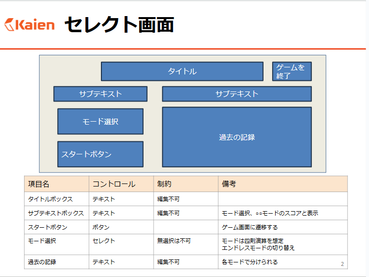
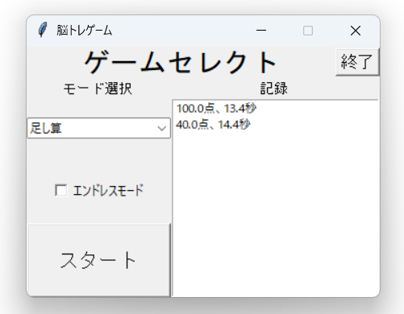
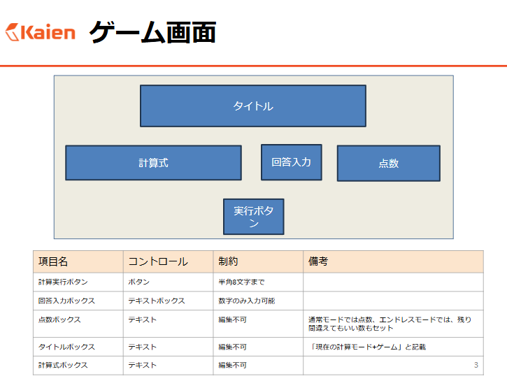
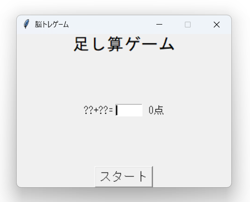

# ポートフォリオ

## 「脳トレゲーム.xlsm」の python へ移植と改良

### ◆ プロジェクトの概要

#### プロジェクトの内容

VBA で記述された簡単な脳トレゲームを Python に移植し\
それにあたって機能をより使いやすく、遊べる内容を充実させる改修を行いました。

#### プロジェクトの工程

- 開発開始 2024/10/21
- 画面設計・基本設計 ~2024/10/28
- スケジュール表作成 ~2024/11/01
- コーディング ~2024/11/18
- テスト ~2024/11/22

### ◆ 使用したライブラリ

- Python 3.13.0
- tkinter 8.6.14
- Pyinstaller 6.11.1

### ◆ 画面設計
||画面設計|スクリーンショット|
|---|---|---|
|セレクト画面|||
|ゲーム画面|||

### ◆ 機能

- 計５問の計算問題が行える
- 計５問のクイズ問題が行える
- 回答によるスコアの集計ができる
- 過去の記録ができる
- 問題数無制限で残機制のエンドレスモード

### ◇ 成果物（ドキュメント）

- 画面設計書
- スケジュール表
- テスト仕様書
- ソースコード
- 実行ファイル

### ◇ 著者

作成者:中澤春汰
