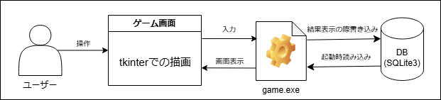

# ポートフォリオ

## 「脳トレゲーム.xlsm」の python へ移植と改良

### ◆ プロジェクトの概要

#### プロジェクトの内容

VBA で記述された簡単な脳トレゲームを Python に移植し\
それにあたって機能をより使いやすく、遊べる内容を充実させる改修を行いました。

#### プロジェクトの工程

- 開発開始 2024/10/21
- 画面設計・基本設計 ~2024/10/28
- スケジュール表作成 ~2024/11/01
- コーディング ~2024/11/18
- テスト ~2024/11/22

### ◆ 使用したライブラリ

- Python 3.13.1
- tkinter 8.6.15
- Pyinstaller 6.11.1
- sqlite3 3.45.3

### ◆ 構成図

### ◆ 画面設計
|画面設計|スクリーンショット|
|---|---|
|||
|||

### ◆ 機能
#### 移植した機能
- 計５問の計算問題が行える
- 回答によるスコアの集計ができる
#### 追加された機能
- クイズ機能
- 過去スコアの記録機能（全モード対応）
- 回答までの時間測定機能
- 現在スコアのリアルタイム表示機能
- レベルアップの概念を追加
- 残機制のエンドレスモード

### ◇ 成果物（ドキュメント）

- [画面設計書](https://github.com/haru315/porting-game/blob/main/%E8%84%B3%E3%83%88%E3%83%AC%E3%82%B2%E3%83%BC%E3%83%A0_%E7%94%BB%E9%9D%A2%E8%A8%AD%E8%A8%88%E6%9B%B8.pdf)
- [スケジュール表](https://github.com/haru315/porting-game/blob/main/%E8%84%B3%E3%83%88%E3%83%AC%E3%82%B2%E3%83%BC%E3%83%A0%E6%A9%9F%E8%83%BD%E4%B8%80%E8%A6%A7%E3%83%BB%E3%82%B9%E3%82%B1%E3%82%B8%E3%83%A5%E3%83%BC%E3%83%AB%E8%A1%A8.pdf)
- [テスト仕様書](https://github.com/haru315/porting-game/blob/main/%E8%84%B3%E3%83%88%E3%83%AC%E3%82%B2%E3%83%BC%E3%83%A0%E3%83%86%E3%82%B9%E3%83%88%E4%BB%95%E6%A7%98%E6%9B%B8.pdf)
- [ソースコード](https://github.com/haru315/porting-game/blob/main/game.py)
- [実行ファイル](https://github.com/haru315/porting-game/blob/main/game.exe)

### ◇ 著者

作成者:中澤春汰
